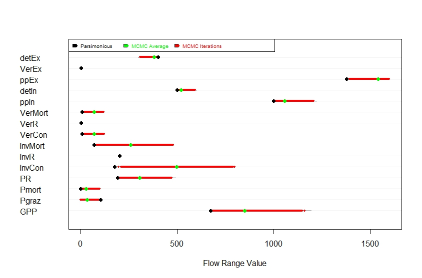
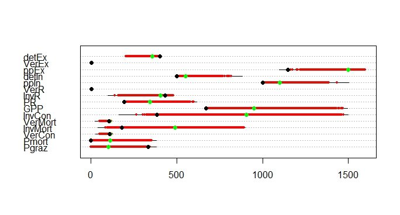
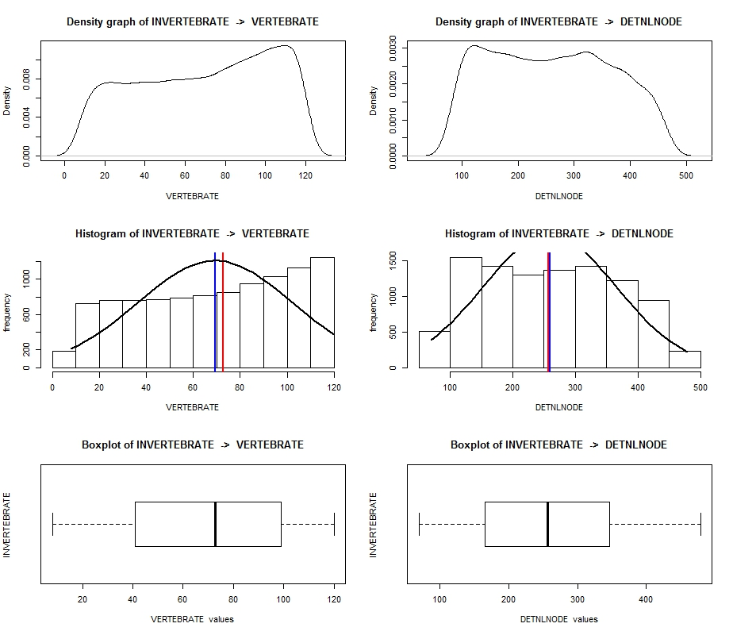
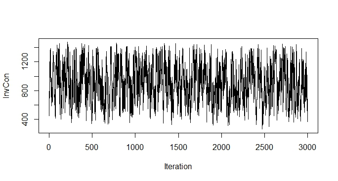
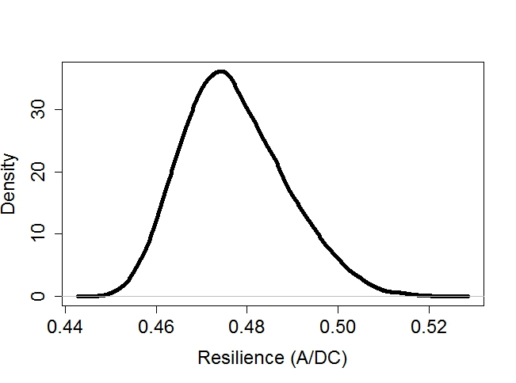
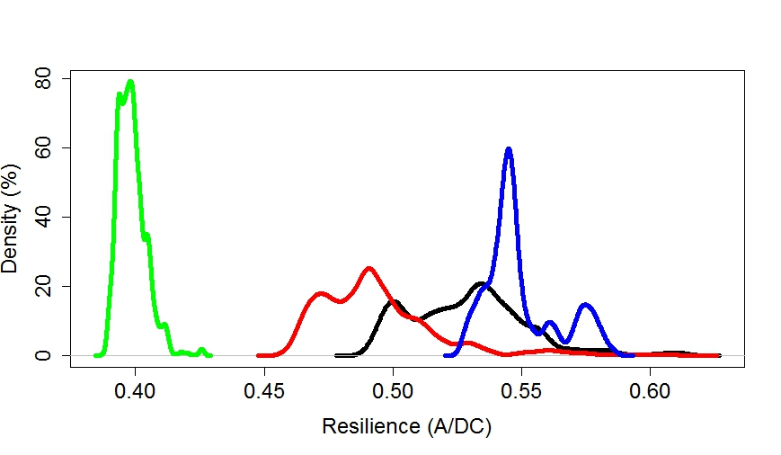
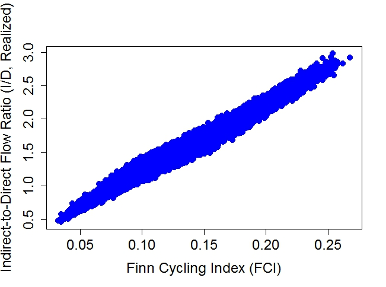

**Abstract**

Linear inverse modelling (LIM) can be used to quantify complex flow
networks. We present R package LIMpack (Waspe, Mahabir and Scharler
2017) which is a novel approach for solving flow network problems
through creating a list of plausible networks solved using LIM. The flow
network is constructed in text files in a logical and understandable
manner. LIMpack then converts this input into the required equality and
inequality constraints. These are solved using linear programming
techniques. A list of plausible flow networks is created for further
analysis. LIMpack restructures this list, enabling Ecological Network
Analysis (ENA) to be performed on the flow network.

We give a simple flow network to illustrate the use of the package and
apply it to more complex flow networks to demonstrate its uses.

If you use this package, please cite as: (Waspe, Mahabir, and Scharler
2017).

*Keywords*: Linear inverse modelling, flow network, food web, Ecological
Network Analysis (ENA)

**Introduction**

Quantification of flow networks such as food webs often create many
problems due to data deficiency. This is because direct flow measurement
is particularly difficult, even in comparatively well sampled systems.
To overcome these data limitations linear inverse modelling (LIM) has
been developed. This methodology allows for the quantification of
interactions in a complex flow network from incomplete and uncertain
data. LIM uses a set of equality and inequality equations from the
provided data set and several constraints to set up a solution space in
which the infinite number of flow solutions exist. The LIM problem is
solved a selected number of times or iterations (eg 10 000) providing a
set of plausible food webs. Once these networks have been constructed
using LIM further analysis can be performed. Ecological Network Analysis
(ENA) provides a mathematically means to understand various system
components and attributes. For ENA to be performed a single solution
needs to be selected from the ensemble, for example the mean or the
median. This single solution approach is one of the biggest issues in
network ecology as it ignores the environmental variability within an
ecosystem and the mathematical variability within the model solutions.
This package (**LIMpack**) allows the user a novel approach to create a
range of plausible solved food web networks and analyse this range using
the ENA approach. This package also provides the user with the ability
to ensure the number of networks have adequately sampled the LIM
solution space and that these networks accurately represent the
environmental constraints.

Following are the methods for LIM built on from R-package **LIM** (van
Oevelen, van den Meersche, Meysman, Soetaert, Middelburg, and Vezina
2009)**.**

**Linear Inverse Modelling**

Linear inverse problems can be defined in matrix notation as:

**A · x ≈ b** (1)

**E · x = f** (2)

**G · x ≥ h** (3)

There are three sets of linear equations: equalities that must be met as
closely as possible (1), equalities that must be met exactly (2) and
inequalities (3).

The problem generally only contains the last two equations (2, 3), with
the first equation (1) added to a single solution.

Linear programming methods are the main techniques used to solve for
**x** in these models. In R, these techniques are available through the
packages **LIM** (van Oevelen, van den Meersche, Meysman, Soetaert,
Middelburg, and Vezina 2009) and **limSolve** (Soetaert, Van den
Meersche, and van Oevelen 2009). These packages are incorporated into
our package **LIMpack**.

Depending on the active set of equalites (2) and constraints (3), the
system may either be underdetermined, even determined or overdetermined.
Complex flow network problems are almost always underdetermined. Solving
each of these problems requires different mathematical approaches:

-   If the model is even determined, there is only one solution that
    satisfies the equations exactly. This solution can be singled out by
    using the least squares method *lsei* from the package **limSolve**.

-   If the model is overdetermined, there is only one least squares
    solution which can be singled out by the function *lsei* (package
    **limSolve**).

-   If the model is underdetermined, such as with flow network problems,
    there exists an infinite amount of solutions. To solve these, there
    are several options:

    -   *ldei* – finds the “least distance” solution

    -   *lsei* – minimises some other set of functions (equation 1) in a
        least squares sense

    -   *linp* – finds the solution where one linear function (sum of
        the unknowns) is either minimised or maximised

    -   *xranges* – finds the possible ranges (min,max) for each unknown

    -   *xsample* – randomly samples the solution space using a Monte
        Carlo Markov Chain (MCMC). This method returns the marginal
        probability density function for each unknown (Van den Meersche,
        Soetaert, and Van Oevelen 2009)

-   Our package (**LIMpack**) uses the X*sample* technique to create a
    list of potential solutions to each problem.

The *Xsample* technique uses a sampling method based on the Markov Chain
Monte Carlo algorithm to retrieve a distribution of flow values from
within the solution set (van Oevelen *et al* 2010).

**Flow networks**

It is vital for the LIM models to be setup correctly as many unknowns
must be simultaneously estimated and the problem contains many equality
and inequality constraints. We provide the modified and streamlined
structure for the LIM model which the R-package **LIMpack** solves
(using techniques from the package **LIM**).

Flow networks are represented as a set of nodes (compartments), which
are connected by arrows (flows). The arrows generally have a direction:

*A B*

Indicates a flow from *A* to *B*, while:

*A B*

Indicates a flow in both directions.

There can only be one flow from *A* to *B*, and there can be a flow from
*B* to *A*.

Solving the LIM problem consists of finding the values of these flows.

*Simple food web example*

A food web is a representation of the energy flow between biotic and
abiotic components of an ecosystem and any energy exchange across the
system boundary. Organisms eat and are eaten. Part of the food is used
for biomass production and reproduction, part is expelled as faeces or
respired. Autotrophic organisms produce biomass from light energy and
inorganic compounds, whilst non-living matter (detritus) may be consumed
by animals and bacteria and added to from dead organisms and faeces.

A food web model represents the mass balances of flows between several
groups or organisms and detritus. In our LIM, the unknowns are the
weights of the food web flows connecting the biotic and abiotic
components.

As an example, we will present a simple food web (figure) with four
components: detritus, a plant (autotroph) and two animals(heterotrophs):
an invertebrate which feeds on detritus and the plant, a vertebrate
which feeds on the invertebrate. The food web is assumed to be in a
steady state, masses (flow weights and node masses) remaining unchanged
in time. There are ten flows (table) which connect the components with
each other and with outside the system.

| **Flow Name**                                  | **Abbrevaition** |
|------------------------------------------------|------------------|
| Gross Primary Production                       | GPP              |
| Grazing on Plant                               | Pgraz            |
| Plant Respiration                              | PR               |
| Plant Mortality                                | Pmort            |
| Grazing on detritus (Invertebrate Consumption) | InvCon           |
| Invertebrate Respiration                       | InvR             |
| Invertebrate Mortality                         | InvMort          |
| Consuming invertebrate                         | VerCon           |
| Vertebrate Respiration                         | VerR             |
| Vertebrate Mortality                           | VerMort          |

The mass balance equations for the internal flows between the four
components, with the rate of change = 0, is given by:

\[\frac{\text{dPLANT}}{\text{dt}} = 0 = Gross\ primary\ production - grazing\ on\ plant - plant\ respiration - \ plant\ mortality\]

\[\frac{\text{dINVERTEBRATE}}{\text{dt}} = 0\  = grazing\ on\ plant + grazing\ on\ detritus\]

\[- invertebrate\ respiration - invertebrate\ mortality\]

\[\frac{\text{dVERTEBRATE}}{\text{dt}} = 0 = consuming\ invertebrate - vertebrate\ respiration\]

\[- vertebrate\ mortality\]

\[\frac{\text{dDETRITUS}}{\text{dt}} = 0 = plant\ mortality + \ invertebrate\ mortality + \ vertebrate\ mortality\]

\[- grazing\ on\ detritus\]

These mass balances can be written in a more general way:

0 = 1·*GPP -* 1·*Pgraz* - 1·*Pmort* - 1·*PR* + 0·*InvCon* + 0·*InvR* +
0·*InvMort* + 0·*VerCon* + 0·*VerR* + 0·*VerMort*

0 = 0·*GPP* + 1·*Pgraz* + 0·*Pmort* + 0·*PR* + 1·*InvCon* - 1·*InvR* -
1·*InvMort* - 1·*VerCon* + 0·*VerR* + 0·*VerMort*

0 = 0·*GPP* + 0·*Pgraz* + 0·*Pmort* + 0·*PR* + 0·*InvCon* + 0·*InvR* +
0·*InvMort* + 1·*VerCon* - 1·*VerR* - 1·*VerMort*

0 = 0·*GPP* + 0·*Pgraz* + 1·*Pmort* + 0·*PR -* 1·*InvCon* + 0·*InvR* +
1·*InvMort* + 0·*VerCon* + 0·*VerR* + 1·*VerMort*

The zero on the left-hand side relates to a sum of products, where each
product is composed of the flows and a coefficient. The coefficient
indicates if and by how much these flows contribute to the rate of
change.

Assume that the respiration for the invertebrate (InvR) has been
directly measured. We can add an extra equation:

*InvR = 200*

We obtain, in matrix notation:

\[\begin{bmatrix}
1 - 1 - 1 - 1\ 0\ 0\ 0\ 0\ 0\ 0 \\
0\ 1\ 0\ 0\ 1 - 1 - 1 - 1\ 0\ 0 \\
0\ 0\ 0\ 0\ 0\ 0\ 0\ 1 - 1 - 1 \\
0\ 0\ 1\ 0 - 1\ 0\ 1\ 0\ 0\ 1\  \\
0\ 0\ 0 - 1\ 0\ 0\ 0\ 0\ 0\ 0 \\
\end{bmatrix} \bullet \begin{bmatrix}
\text{GPP} \\
\text{Pgraz} \\
\text{Pmort} \\
\text{PR} \\
\text{InvCon} \\
\text{InvR} \\
\text{InvMort} \\
\text{VerCon} \\
\text{VerR} \\
\text{VerMort} \\
\end{bmatrix} = \begin{bmatrix}
0 \\
0 \\
0 \\
0 \\
 - 200 \\
\end{bmatrix}\]

We can now illustrate the full system in matrix notation with internal
flows and flows between the system and the external. Flows across the
system boundary are imports, exports or respiration:

\[\begin{bmatrix}
1 - 1 - 1 - 1\ 0\ 0\ 0\ 0\ 0\ 0\ 1\ 0 - 1\ 0\ 0 \\
0\ 1\ 0\ 0\ 1 - 1 - 1 - 1\ 0\ 0\ 0\ 0\ 0\ 0\ 0\ 0 \\
0\ 0\ 0\ 0\ 0\ 0\ 0\ 1 - 1 - 1\ 0\ 0\ 0 - 1\ 0 \\
0\ 0\ 1\ 0 - 1\ 0\ 1\ 0\ 0\ 1\ 0\ 1\ 0\ 0 - 1 \\
0\ 0\ 0 - 1\ 0\ 0\ 0\ 0\ 0\ 0\ 0\ 0\ 0\ 0\ 0 \\
\end{bmatrix} \bullet \begin{bmatrix}
\text{GPP} \\
\text{Pgraz} \\
\text{Pmort} \\
\text{PR} \\
\text{InvCon} \\
\text{InvR} \\
\text{InvMort} \\
\text{VerCon} \\
\text{VerR} \\
\text{VerMort} \\
\text{ppIn} \\
\text{detIn} \\
\text{ppEx} \\
\text{VerEx} \\
\text{detEx} \\
\end{bmatrix} = \begin{bmatrix}
0 \\
0 \\
0 \\
0 \\
 - 200 \\
\end{bmatrix}\]

As can be seen, the matrices begin to get larger and more complicated
even though this is a very small model.

The consumption, defaecation and respiration flows are not independent
of one another. Organisms cannot produce more faeces than the amount of
food they consume. In foodweb modelling, it is always assumed faeces
production is a fraction of food ingested. Organisms also respire and
require energy for growth. Therefore, some of the food that is
assimilated (i.e. not defecated) is used to produce new biomass and some
will provide energy for this (growth cost). Some of this energy is also
respired. These flows are very difficult to measure and thus are
constrained between a range of production: biomass ratios and
respiration: production ratios, as well as an assimilation efficiency
(growth cost). The imports into the system and out of the system are
also constrained within a range. The following are constraints which are
used to calculate the inequality equations:

ppNPP &gt; pp \* 0.6

ppNPP &lt; pp \* 1.1

ppR &gt; ppNPP \* 0.4

ppR &lt; ppNPP \* 0.7

invertebrateP &gt; invertebrate \* 0.004

invertebrateP &lt; invertebrate \* 0.06

vertebrateP &gt; vertebrate \* 0.0003

vertebrateP &lt; vertebrate \* 0.005

vertebrateR &gt; vertebrateP \* 1.5

vertebrateR &lt; vertebrateP \* 4

invertebrateC - InvMort &gt; 0.4\*invertebrateC

invertebrateC - InvMort &lt; 0.75\*invertebrateC

ppIn &lt; 1600

ppIn &gt; 1000

detIn &lt; 1500

detIn &gt; 500

ppEx &lt; 1600

ppEx &gt; 1000

verEx &lt; 0.36

verEx &gt; 0.21

detEx &lt; 400

detEx &gt; 200

Once the inequality equations are calculated the following matrix can be
produced.

\[\left\lbrack \right\rbrack \bullet \begin{bmatrix}
\text{GPP} \\
\text{Pgraz} \\
\text{Pmort} \\
\text{PR} \\
\text{InvCon} \\
\text{InvR} \\
\text{InvMort} \\
\text{VerCon} \\
\text{VerR} \\
\text{VerMort} \\
\text{ppIn} \\
\text{detIn} \\
\text{ppEx} \\
\text{VerEx} \\
\text{detEx} \\
\end{bmatrix} = \begin{bmatrix}
 - 880 \\
480 \\
0 \\
0 \\
 - 120 \\
8 \\
 - 2.50 \\
0.15 \\
0 \\
0 \\
0 \\
0 \\
 - 1600 \\
1000 \\
 - 1500 \\
500 \\
 - 1600 \\
1000 \\
 - 0.36 \\
0.21 \\
 - 400 \\
200 \\
0 \\
0 \\
0 \\
0 \\
0 \\
0 \\
0 \\
0 \\
0 \\
0 \\
0 \\
0 \\
0 \\
\end{bmatrix}\]

This model has 5 equations and 22 inequalities: there are 15 unknown
flows. How this problem can be solved with **limSolve** which is
incorporated in the **LIMpack** will be outlined below.

**Specifying a Linear Inverse Model in R-package LIMpack**

The previous example gives an indication of the resultant matrices which
arise from various equations and inequalities.

The equations for LIM are specified on unknowns which are themselves
linear combinations of other unknowns. This can be explained from the
example given previously: the flow from the invertebrate to detritus
(faecal production) is specified a fraction of the amount of food
ingested. Ingested food (consumption) is the sum of the flow from plant
to invertebrate and detritus to invertebrate.

The model input for **LIMpack** represents these types of relationships.
To implement the food web model, we must define the variables, e.g.
invertebrate consumption. ‘Invertebrate consumption’ is the sum of the
two feeding flows mentioned. The constraints will be rewritten as a
function of the unknowns when the LIM input is described. **limSolve**
generates the mass balances for each component, based on the flows that
were defined. This assists with adding or removing elements.

Following on with the previous food web example, we now will describe
the structure of the **LIMpack** input file. The structure of the input
file must follow a certain set of rules for **LIMpack** to correctly
identify certain elements and create the LIM and enaR network lists.

The structure of the declaration file must obey the following
guidelines:

-   All guidelines outlined in “5. Structure of the LIM input file” in
    **LIM** package (van Oevelen, van den Meersche, Meysman, Soetaert,
    Middelburg, and Vezina 2009). Provided in the appendix
    for simplicity.

-   In the ‘\#\#\#Component’ section, all non-living (dead) component
    names (e.g. detritus) are required to have ‘NLNode’ in the component
    name i.e. detritus would be detNLNode or detritusNLNode. It is not
    case sensitive as the LIM ‘Setup’ function converts all components
    to uppercase.

-   In the ‘\#\#\#Externals’ section, the respiration element (e.g. CO2)
    is required to feature FIRST.

-   In the ‘\#\#\#Externals’ section, all Imports (e.g. ppInput) are
    require to have ‘Input’ at the end of the name, with the ‘I’ in
    UPPERCASE, i.e. plant import would be plantInput. This is
    case sensitive.

-   In the ‘\#\#\#Externals’ section, all Exports (e.g. ppExport) are
    required to have ‘Export’ at the end of the name, with the ‘E’ in
    UPPERCASE, i.e. plant export would be plantExport. This is
    case sensitive.

The input for the food web example is documented below:

\#\#\#Example four node network

\#\#\#Component

!Steady state biomasses: mgC/m2

pp = 800 !Plant

inv = 2000 !Invertebrate

ver = 500 !Vertebrate

detNLNode = 10000 !Detritus

\#\#\#End component

\#\#\#Externals

CO2

ppInput

ppExport

verExport

detNLNodeInput

detNLNodeExport

\#\#\#End Externals

\#\#\#Variables

!Plant

ppGPP = GPP

ppR = PR

ppNPP = ppGPP - ppR

!Organisms

invC = Pgraz + InvCon

invR = InvR

invP = invC - invR - InvMort

verC = VerCon

verR = VerR

verP = verC - verR - VerMort

\#\#\#End Variables

\#\#\#Flows

GPP : CO2 -&gt; pp !Plant energy gain

Pgraz : pp -&gt; inv !Grazing on plant

Pmort : pp -&gt; detNLNode !Plant mortality

PR : pp -&gt; CO2 !Plant respiration

InvCon : detNLNode -&gt; inv !Feeding on detritus

InvR : inv -&gt; CO2 !Invertebrate respiration

InvMort : inv -&gt; detNLNode !Invertebrate mortality

VerCon : inv -&gt; ver !Feeding on invertebrate

VerR : ver -&gt; CO2 !Vertebrate respiration

VerMort : ver -&gt; detNLNode !Vertebrate mortality

ppIn : ppInput -&gt; pp !Plant import

detIn : detNLNodeInput -&gt; detNLNode !Detritus import

ppEx : pp -&gt; ppExport !Plant export

VerEx : ver -&gt; verExport !Vertebrate export

detEx : detNLNode -&gt; detNLNodeExport !Detritus export

\#\#\#End Flows

\#\#\#Parameters

ppNPPratioBmin = 0.6

ppNPPratioBmax = 1.1

ppRratioNPPmin = 0.4

ppRratioNPPmax = 0.7

verPratioBmin = 0.004

invPratioBmax = 0.06

invRratioPmin = 1

invRratioPmax = 4

verPratioBmin = 0.0003

verPratioBmax = 0.005

verRratioPmin = 1.5

verRratioPmax = 4

\#\#\#End parameters

\#\#\#Inequalities

ppNPP = pp \* \[ppNPPratioBmin, ppNPPratioBmax\]

ppR = ppNPP \* \[ppRratioNPPmin, ppRratioNPPmax\]

invP = inv \* \[invPratioBmin, invPratioBmax\]

invR = invP \* \[invRratioPmin, invRratioPmax\]

verP = ver \* \[verPratioBmin, verPratioBmax\]

verR = verP \* \[verRratioPmin, verRratioPmax\]

invC - InvMort &gt; 0.4\*invC

invC - InvMort &lt; 0.75\*invC

ppIn &lt; 1600

ppIn &gt; 1000

detIn &lt; 1500

detIn &gt; 500

ppEx &lt; 1600

ppEx &gt; 1000

verEx &lt; 0.36

verEx &gt; 0.21

detEx &lt; 400

detEx &gt; 200

\#\#\#End Inequalities

It is important to note the use of
‘\#\#\#SectionName…\#\#\#EndSectionName’ to declare items; the sections
‘\#\#\#Stocks and ‘\#\#\#External’ define the names; a mass balance
equation is only generated for stocks (which define the components of
the food web), not for the externals. A name is declared as “name: “,
and exclamation mark (!) demarcates the start of comment, which is
ignored when read.

Although this can be a lengthy process, the problem formulation is
elegant, more flexible, less error-prone, and can easily be adjusted at
a later point.

Based on this input file, the matrices are generated and put in a list.
The resulting output is solved numerous times using *Xsample*,
generating several plausible solutions for each flow.

**Creating a list of plausible solved networks and enaR network objects
using LIMpack:**

The **LIMpack** input file is used to create the matrices and vectors
that constitute the LIM problem. This is solved using *xsample* to
create a list of multiple plausible networks. This LIM list of solved
plausible networks is converted to a list of **enaR** network objects,
ready to be used for network analysis in the R package **enaR** (ref.).

The following table indicates the functions of **LIMpack** which creates
these lists:

| **Phase** | **All Functions**    | **Core functions** | **Main Function** |
|----------------------------------------------------------|----------------------|--------------------|-------------------|
| 1.  preparation                                          | 1.1.1) LIMcheck      | LIMcheck           | enaListGen        |
|                                                          | 1.1.2) LimListGen    | LimListGen         |                   |
|                                                          | 1.2.1) flowCheck     |                    |                   |
|                                                          | 1.2.2) nodeViability |                    |                   |
| 1.  Calculation/packing                                  | 2.1) internalFlowGen | internalFlowGen    |                   |
|                                                          | 2.2) inputVector     | inputVector        |                   |
|                                                          | 2.3) respVector      | respVector         |                   |
|                                                          | 2.4) exportVector    | exportVector       |                   |
|                                                          | 2.5) ouputVector     | ouputVector        |                   |
|                                                          | 2.6) biomassVector   | biomassVector      |                   |
|                                                          | 2.7) livingVector    | livingVector       |                   |
|                                                          | 2.8) PackNet         | PackNet            |                   |
|                                                          | 2.9) enaListGen      | enaListGen         |                   |
| 1.  plotting                                             | 3.1) PlotInternals   |                    |                   |
|                                                          | 3.2) PlotRange       |                    |                   |
|                                                          | 3.3) plotFlowRange   |                    |                   |

All the functions will first be explained, then a more detailed
explanation of the main function, **enaListGen** will follow. The full
operational procedure for this package is outlined. It is advised that
the user follows the procedure, using all Core functions to fully
understand how the package works and what is being done, however then
main function, **enaListGen** provides a one function shortcut. The
constrained four node network input file given as an example earlier in
the document is used to illustrate the use of all **LIMpack** functions.

**All Functions**

The detailed list of **LIMpack** functions:

**1.) Preparation**

The **Core Functions,** which is essential for the **enaR** network
object creation is as follows:

**1.1) Core Functions**

The modified LIM input file is used to create a list containing “network
objects”, as described in enaR (referencing or link), based on the
single network model stated.

To determine if the setup structure of the LIM file is correct, the
function *LIMcheck()* should be run. This provides the user with a
visual output. This ensures that what the function understands
correlates to what the user intended (example given below in
**1.1.1)**).

Installing the LIM package and the enaR package is done in this function
thus there is no need to do it prior e.g. using the functions *Read* or
*Setup* from the **LIM** package.

The user is required to set the working directory through the use of the
*setwd()* function.

**1.1.1) *LIMcheck***

Running the **1.1.1) *LIMcheck()*** function:

*LIM4Node &lt;- LIMcheck(Rfile = "4node.r")*

This function outputs the result:

*LIM files require to be 'packed' to be used for analysis with enaR.*

*To properly complete the packing process, the LIM file structure must
be correct.*

*The following details indicate vital information.*

*Network nodes: PP INVERTEBRATE VERTEBRATE DETNLNODE*

*Externals: CO2 ppInput ppExport detNLNodeInput vertebrateExport
detNLNodeExport*

*Input nodes: ppInput detNLNodeInput*

*Export nodes: ppExport vertebrateExport detNLNodeExport*

*Respiration Element: CO2*

*Non-Living nodes: DETNLNODE*

*If the above details do not represent your model correctly, please
adjust your LIM input file and re-run this method*

The output result of the function is ensuring the **LIMpack** input file
has been structured correctly. This is vital as **LIMpack** requires the
previously specified rules to accurately create the **enaR** network
object.

Using the codes ‘LIM4Node$Components’ and ‘LIM4Node$Externals’, you can
see the network nodes and externals are displayed as laid out in the
**LIMpack** input file. Also shown are the elements that will be used
for inputs, exports, respiration, and non-living vectors.

The output of this function is equivalent to the output generated by
running the *setup* function from **LIM** package.

Once the information has been verified, multiple plausible LIM networks
can be generated from this output. To visually represent the various
networks using the plotting functions, the following function,
**LimListGen** must be performed before the main **EnaListGen**
function.

**1.1.2) LimListGen**

Running the **1.1.2) LimListGen()** function:

*Var4Node &lt;- LimListGen(limfile = LIM4Node, …)*

Produces the output

*Generating Variations*

*==============================================================================*

*Variations created*

The variable “Var4Node” is in the form of a list. The second item is the
result of running the ‘*Xsample()*’ function from the **LIM** package.
The first item is created from applying the function ‘*Flowmatrix()*’,
also from the **LIM** package, onto the results of ‘*Xsample()*’. Item 1
is a list, item 2 is a matrix.

List Item 1 can be accessed through: Var4Node$FlowMatrices

Each matrix in the list represents the flow matrix from a plausible
network.

List Item 2 can be accessed through: Var4Node$EntireVariations

Each row in the matrix represents the value of that flow for each
plausible network.

Further arguments for the *LimListGen* function are defaulted to the
‘*Xsample’* function. This include specifying the iterations and jumps
applied to the LIM file e.g.:

*Var4Node &lt;- LimListGen(limfile = LIM4Node, iter=10 000, jmp=5)*

This will solve the model 10 000 times with a jump length of 5 using the
function *Xsample* from **LIM** package.

This function creates a list of solved plausible networks. To run
Ecological Network Analysis on these networks using the package
**enaR**, the list of networks need to be reformatted. The
**enaListGen** (explained at the end of this section) function performs
this task.

Once the networks have been generated, three plotting functions can be
applied to visualizing the resulting flow values. This is extremely
helpful as it indicates the proportion of the solution space sampled and
the manner this has been done. These functions are *plotRange,
plotInternals* and *plotFlowRange*. Each is explained in further detail
after the **Core Functions** section in the **Plotting** section.

The table below can be obtained:

| Flow    | min     | max     | Parsimonious | Average |
|---------|---------|---------|--------------|---------|
| GPP     | 672.00  | 1193.06 | 672.00       | 849.96  |
| Pgraz   | 0.00    | 101.80  | 101.80       | 31.52   |
| Pmort   | 0.00    | 101.80  | 0.00         | 27.76   |
| PR      | 192.00  | 491.26  | 192.00       | 304.03  |
| InvCon  | 175.53  | 800.00  | 175.53       | 496.80  |
| InvR    | 200.00  | 200.00  | 200.00       | 200.00  |
| InvMort | 69.33   | 480.00  | 69.33        | 258.96  |
| VerCon  | 8.00    | 120.00  | 8.00         | 69.36   |
| VerR    | 0.32    | 1.44    | 1.44         | 0.81    |
| VerMort | 6.20    | 119.48  | 6.20         | 68.27   |
| ppIn    | 1000.00 | 1221.80 | 1000.00      | 1056.28 |
| detIn   | 500.00  | 601.80  | 500.00       | 521.03  |
| ppEx    | 1378.20 | 1600.00 | 1378.20      | 1542.93 |
| VerEx   | 0.21    | 0.36    | 0.36         | 0.29    |
| detEx   | 298.20  | 400.00  | 400.00       | 379.21  |

This table indicates the minimum and maximum value of each flow. It also
shows the parsimonious solution and the average of the various plausible
solutions solved with *Xsample.*

The above
information can be plotted using **LIMpack** *plotRange* function (which
is explained later in the document), indicating the range, the
parsimonious solution (black point), the average *Xsample* value (green
point) and each plausible solution (indicated by a red point). This
gives an indication of the amount the range has been sampled by
*Xsample.*

**1.2) Optional Preparations: **

When preparing the network data for processing, certain “cleaning”
methods can be done to better prepare the data.

The first optional check is the *flowCheck()* function. This function
cross-checks the generated flow matrices from the variations generated
in the *LimListGen()* function with the original flow matrix generated
by the *Setup()* function run on the LIM input file. If there is a cell
value larger than 0 in the original flow matrix (i.e. a flow was
originally specified to exist in the LIM input file), there should be a
cell value greater than 0 in the generated list. In the same way, if
there is a 0 (I.e. no flow was originally specified), there should be a
0. Generated matrices usually follow the original matrix if the network
model is constrained correctly.

**1.2.1) flowCheck**

Running the **1.2.1) flowCheck()** function:

*CrossCheckedFlows &lt;- flowCheck(limfile = LIM4Node, matList =
Var4Node$FlowMatrices)*

Produces a list environmental variable *CrossCheckedFlows* which
contains 2 lists.

List Item 1 can be accessed through: Var4Node$AcceptedList

List Item 2 can be accessed through: Var4Node$DiscardedList

**1.2.2) nodeViability**

The second optional check is the nodeViability() function. In this
function, restrictions can be applied to the matrices through
restricting a specific flow. With the parameters looking like so:

nodeViability(limfile, matList,"NodeFrom","NodeTo",MinVal,MaxVal)

a restriction will be applied to the matrix list and output a new list
with only matrices that adhere to the restriction. Additionally, both
MinVal and MaxVal need not be specified, as only providing one will act
as either a value boundary.

Running the **1.2.2) nodeViability()** function in the 3 possible ways:

*viableNodesRange&lt;- nodeViability(limfile = LIM4node,matList =
Var4Node$FlowMatrices,* *nodeFr = "PP",* *nodeTo = " INVERTEBRATE
",minVal = val1, maxVal = val2)*

*viableNodesMin &lt;- nodeViability(limfile = LIM4node, matList =
Var4Node$FlowMatrices,* *nodeFr = "PP",* *nodeTo = " INVERTEBRATE
",minVal = val1)*

*viableNodesMax&lt;- nodeViability(limfile = LIM4node, matList =
Var4Node$FlowMatrices,* *nodeFr = "PP",* *nodeTo = " INVERTEBRATE “,
maxVal = val2)*

produces the following results:

*viableNodesRange* is a list containing all matrices where the values
for the flow from *PP* to *INVERTEBRATE* fall between val1 and val2.

*viableNodesMin* is a list containing all matrices where the values for
the flow from *PP* to *INVERTEBRATE* fall above val1.

*viableNodesMax* is a list containing all matrices where the values for
the flow from *PP* to *INVERTEBRATE* fall below val2.

**2) enaR Packing:**

Ecological Network Analysis (ENA) is a branch of network ecology used to
holistically analyse environmental interactions. This methodology can be
used address a range ecosystem questions. enaR is package which allows
for this complex network analysis. Traditionally, ENA has focused on
only one value for each index to describe the system or system
properties. This ignores the inherent environmental and mathematical
variability in ecosystem modelling. The LIMpack package allows for the
analysis of a range of plausible networks and therefore can produce a
range of values for each ENA index. The list of LIM networks created
earlier need to be reformatted and packed to be analysed in **enaR.**

To create **enaR** network objects, certain requirements need to be met.

(directly from **enaR** vignette)

Network Data Class

The enaR package stores the model data in the network class defined in
the network package (Butts input2008a). In this software, a complete
ecosystem network model description includes:

• F is the n × n flow matrix, oriented row-to-column

• z a vector of inputs

• r a vector of respirations

• e a vector of exports

• y a vector of outputs, which are respirations plus exports

• X a vector of biomass or storage values

• Living = logical vector indicating if the node is living (TRUE) or
non-living (FALSE)

(end quote)

The process of creating F, z, e, r, y, X and Living using the
**LIMtoENA** package will be described. As the objective is to create a
list of enaR network objects, some of the values above may be in list
form. The following section outlines the step by step functions required
to reformat and pack the LIM network list into an enaR network object
list. However, once the LIM network list has been generated (using the
**variationGen** function), the **enaListGen** function (explained at
the end of this section) can be used to quickly reformat and pack in to
an enaR network object list.

F - The function **2.1) internalFlowGen()** pulls the flow matrices from
Var4Node$FlowMatrices and removes the externals, thus producing a list
of flow matrices consisting of only the internal flows.

*InternalFlowMatrices &lt;- internalFlowGen(limfile = LIM4Node, matList
= Var4Node$FlowMatrices)*

z - The function **2.2) inputVector()** generates vectors by processing
the rows of “input” nodes in the flow matrices. A vector is the length
of the number of internal nodes in the modes, in this instance it will
be of length 4. For each node, the total input (respiration element +
all external inputs) is summed up and a single value is stored in a
vector. This is repeated for each matrix in the *Var4Node$FlowMatrices*
list and a list of vectors the same length of *Var4Node$FlowMatrices* is
created.

*inputVectorList &lt;- inputVector (limfile = LIM4Node, matList =
Var4Node$FlowMatrices)*

r - The function **2.3) respVector()** creates a list of vectors for the
presented respiration element. If the LIM file is structured properly,
the respiration element will be first on the externals list. Each vector
will be the length of the number of internal nodes and the list will be
the length of *Var4Node$FlowMatrices.* This vector receives its values
from the respiration node column.

*respVectorList &lt;- respVector(limfile = LIM4Node, matList =
Var4Node$FlowMatrices) *

e - The function **2.4) exportVector()** works in the same way as the
inputVector() function, however, this function processes the columns of
“export” nodes for each node in the flow matrices.

*exportVectorList &lt;- exportVector(limfile = LIM4Node, matList =
Var4Node$FlowMatrices) *

y - The function **2.5) outputVector()** simply uses vector addition for
the respective export vector and the respiration vector in the vector
lists. This produces another list of vectors.

*outputVecList &lt;- outputVector(limfile = LIM4Node, expVec =
exportVectorList, rspVec = respVectorList)*

x - The function **2.6) biomassVector()** creates a single vector of
values representing the biomass of the nodes in question. These values
are pulled from the “STOCKS” section in the LIM file.

*biomassVecList &lt;-biomassVector(limfile = LIM4node)*

Living - The function **2.7) livingVector()** generates a single logical
(TRUE/FALSE) vector based on the naming structure of the LIM file. Nodes
with “NLnode” (not case sensitive) are viewed as non-living nodes and
are thus “FALSE” values in the vector. All living nodes have a “TRUE”
value.

*livingVecList &lt;- livingVector(limfile = LIM4Node) *

This concludes the preparation for “packing” the LIM file into a network
object that is readable in **enaR**. Hereafter, the packing can
commence.

**2.8) PackNet()** is the function that combines all lists and vectors
created for each requirement and produces the **enaR** network object.
Utilizing the “pack” function, with the parameters required, this
function produces a list of **enaR** readable network objects.

*PackedNetworkObjectList &lt;- PackNet(InternalFlowMatrices,
inputVectorList, respVectorList, exportVectorList, outputVecList,
biomassVecList, livingVecList)*

**3) Plotting**

There has been no standardisation in selecting the required number of
iterations and jump size in Linear Inverse Modelling. There has also not
been a means to illustrate whether the solution space has been
adequately sampled by the LIM algorithms. Due to the inherent
variability and complexity in systems it is not possible to standardise
the required number of iterations and jumps size. However, this package
provides functions which allow the user to visually assess whether the
solution space has been adequately sampled by the chosen number of
iterations and jumps. These plotting functions are run using the list of
LIM networks created earlier.

**3.1) PlotRange**

The **PlotRange** function allows the user to generate a plot
illustrating the range of each flow, the parsimonious solution for each
flow, the average of the flow value calculated using the **LimListGen**
function and each iteration calculated using the **LimListGen**
function.

*PlotRange(limfile = LIM4Node, EntireVariations =
Var4Node$EntireVariations)*
This will produce the following plot:

The lines represent the flow range, the black point gives the
parsimonious solution, the green point indicates the mean of the
iterations and each red point represents an iteration.

Further arguments are defaulted to the *PlotRanges* function from
**LIM** package e.g. main title and x axis label.

**3.2) PlotInternals**

The **plotInternals()** function allows the user to generate a plot
illustrating the frequency of values for each flow. This function only
illustrates all flows leaving a defined node as many networks are too
large to illustrate all flows on one plot.

*plotInternals(limfile = LIM4Node, matList = Var4Node$FlowMatrices,
flow= “INVERTEBRATE”)*

This will produce the following plot:

The **plotInternals** function produces a density plot, histogram and
boxplot showing the range of values for each flow leaving the specified
node, in the above example the ‘INVERTEBRATE’ node. Note the need to
have the whole node name in uppercase as the **LIM** *Setup* function
creates it in this manner and the need for “Quotation marks”.

**3.3)** **PlotFlowRange**

The **plotFlowRange** function allows the user to generate a plot which
illustrates the proportion an individual flow has been sampled.

*plotFlowRange(EntireVariations = Var4Node$EntireVariations, flow =
“InvCon”)*

This will
produce the following plot:

The above plot illustrates the MCMC sampling of the InvCon (invertebrate
consumption, detNLNode -&gt; invertebrate) flow. Note the use of
“Quotation marks” and the flow name. If the flows were not named in the
**LIMpack** input file, flow name can be replaced with the flow itself,
“detNLNode -&gt; invertebrate”.

**Main Function**

The main function **EnaListGen** produces a list of **enaR** network
objects from the previously specified **LIMpack** input file. This
function is a one function does all, incorporating all the steps from
the preparation phase. It is very important to note plotting may not be
done if only this function is used. It is therefore recommended the user
either first uses the **preparation** functions and then the
**enaListGen** function or is very sure the solution space is adequately
sampled.

**EnaListGen** is run is follows:

ena4NodeList &lt;- enaListGen(Rfile = “4node.r”)

Produces the result:

*LIM files are required to be 'packed' for analysis with enaR.*

*To properly complete the packing process, the LIM file structure must
be correct.*

*The following details indicate vital information.*

*Network nodes: PP INVERTEBRATE VERTEBRATE DETNLNODE*

*Externals: CO2 ppImport ppExport vertebrateExport detNLNodeImport
detNLNodeExport*

*Import nodes: ppImport detNLNodeImport*

*Export nodes: ppExport vertebrateExport detNLNodeExport*

*Respiration Element: CO2*

*Non-Living nodes: DETNLNODE*

*If the above details do not represent your model correctly, please
adjust your LIM input file and re-run this method.*

*Generating Variations*

*===============================================================================*

*Variations created*

*\[1\] "Internal Flows list created"*

*\[1\] "Input vector list created"*

*\[1\] "Export vector list created"*

*\[1\] "Respiration vector list created"*

*\[1\] "Output vector list created"*

*\[1\] "Living vector list created"*

*===============================================================================*

*\[1\] "Network objects packed"*

The first section of the result is ensuring the **LIMpack** input file
has been structured correctly. This is vital as **LIMpack** requires the
previously specified rules to accurately create the **enaR** network
object. The next section of the result indicates the list of solved
plausible networks has been created. The final section of the result
indicates the various components of the **enaR** network objects and the
list of **enaR** network objects have been created.

Further arguments for the **EnaListGen** function are as follows:

*flowsList*: Indicates the use of the ‘FlowMatrices’ created when using
the *LimListGen* function (explained earlier in the document)

*storeAll:* Boolean. Indicates whether to store each **enaR** component
as a separate list.

*flowCheck:* Boolean. Indicates whether to run *flowCheck* function
(explained earlier).

Further arguments are defaulted to *Xsample* function from **LIM**
package. This includes specifying the number of iterations and jumps
which should be used. For example:

*ena4NodeList &lt;- enaListGen(Rfile = “4node.r”,flowsList = NULL,
storeAll = FALSE, flowCheck = FALSE, iter = 3000, jmp = 10)*

This will initially produce a list of 3000 LIM networks solved with a
jump length of 10. It will then reformat this list and produce a list of
3000 **enaR** network objects. Once the list of enaR network objects has
been created, network analysis can be performed.

**Producing Indices from packed enaRList using enaR package:**

Ecological Network Analysis (ENA) is a branch of network ecology used to
holistically analyse environmental interactions. This methodology can be
used address a range ecosystem questions. **enaR** is package which
allows for this complex network analysis. Traditionally, ENA has focused
on only one value for each index to describe the system or system
properties. This ignores the inherent environmental and mathematical
variability in ecosystem modelling. The LIMpack package allows for the
analysis of a range of plausible networks and therefore can produce a
range of values for each ENA index.

ENA can now be performed the list of **enaR** network objects created
earlier, using the **enaR** package and some extra code outline in this
section.

Refer to enaR vignette for a detailed description of available functions
in this package. Here we present a few examples of how to analyse
multiple models.

The enaR package incorporates the two main schools of Ecological Network
Analysis and provides many functions for these analyses:

| Analysis               | School                        |
|------------------------|-------------------------------|
| Structure              | Foundational/Patten/Ulanowicz |
| Flow                   | Foundational/Patten           |
| Ascendency             | Ulanowicz                     |
| Storage                | Patten                        |
| Utility                | Patten                        |
| Mixed Trophic Impacts  | Ulanowicz                     |
| Control                | Patten                        |
| Environ                | Patten                        |
| Cycle Basis            | Ulanowicz                     |
| Canonical Trophic Agg. | Ulanowicz                     |

For all lists the R function *lapply* is used.

For example, a basic flow analysis can be run on the enaRList:

*Flow4 &lt;- lapply(ena4NodeList, enaFlow)*

This provides us with a list of Flow analyses performed on the enaRList.

Specific information can be extracted and various statistical measures
can be applied:

*TSTlist &lt;- lapply(ena4NodeList, function(x) enaFlow(x)$ns\[2\])*

*TSTs &lt;- unlist(TSTlist)*

*mean(TSTs)*

*3371.862*

A very useful function is *get.ns*. This function extracts all the
network statistics for each model. We then use the *do.call* function to
reshape the network statistics into a single data frame:

*Nslist &lt;- lapply(enaRNodeList, get.ns)*

*Netstats &lt;- do.call(rbind, Nslist)*

From here we can easily calculate various measures of these statistics
such as the mean of TST, as earlier:

*mean(Netstats$TST)*

*\[1\] 3371.862*

However, as mentioned we need to move away from single values for
indices and display the whole range of these values. This can be done on
a plot.

A density plot:

Density plots of a single index:

*dr4 &lt;- density(Netstats$ASC.CAP)*

*plot(dr4,type ="l",lwd = 5, *

*\#ylim = range(den\_alladc),xlim = range(den\_allxadc),*

*xlab="Resilience (A/DC)", cex.axis = 1.5,*

*ylab="Density",cex.lab = 1.5,main="")*

This plot shows the range of values of the relative
ascendency/resilience ENA index.

Having this range allows us to more accurately compare index values
between networks. The following plot shows the A/DC ratio for the same
food web over four different seasons (colours):

If only one value was available, three of the season may appear the same
(A/DC value of 0.55) but now that we have a range of values for the
index we can see there is an overlap but each season is different.

Traditionally, where index values only a single value they could not be
compared to one another. Now that we have a range of potential values,
two indices can be compared:

From this data frame we can create interesting plot for further
analysis:

Comparative plots of two indices:

*plot(Netstats$FCI,ns4$ID.F,pch=20,col="blue",cex=2,*

*ylab="Indirect-to-Direct Flow Ratio (I/D, Realized)",*

*xlab="Finn Cycling Index (FCI)",cex.axis=1.5,cex.lab=1.5)*

As can be seen, the range of values for each index is quite large. It is
also interesting to notice as the cycling within the system increases so
does the I/D ratio.

All the network statistics can be viewed:

*Colnames(Netstats)*

\[1\] "n" "L" "C"

\[4\] "LD" "ppr" "lam1A"

\[7\] "mlam1A" "rho" "R"

\[10\] "d" "no.scc" "no.scc.big"

\[13\] "pscc" "Boundary" "TST"

\[16\] "TSTp" "APL" "FCI"

\[19\] "BFI" "DFI" "IFI"

\[22\] "ID.F" "ID.F.I" "ID.F.O"

\[25\] "HMG.I" "HMG.O" "AMP.I"

\[28\] "AMP.O" "mode0.F" "mode1.F"

\[31\] "mode2.F" "mode3.F" "mode4.F"

\[34\] "H" "AMI" "Hr"

\[37\] "CAP" "ASC" "OH"

\[40\] "ASC.CAP" "OH.CAP" "robustness"

\[43\] "ELD" "TD" "A.input"

\[46\] "A.internal" "A.export" "A.respiration"

\[49\] "OH.input" "OH.internal" "OH.export"

\[52\] "OH.respiration" "CAP.input" "CAP.internal"

\[55\] "CAP.export" "CAP.respiration" "TSS"

\[58\] "CIS" "BSI" "DSI"

\[61\] "ISI" "ID.S" "ID.S.I"

\[64\] "ID.S.O" "HMG.S.O" "HMG.S.I"

\[67\] "NAS" "NASP" "mode0.S"

\[70\] "mode1.S" "mode2.S" "mode3.S"

\[73\] "mode4.S" "lam1D" "relation.change.F"

\[76\] "synergism.F" "mutualism.F" "lam1DS"

\[79\] "relation.change.S" "synergism.S" "mutualism.S"

A description of all indices and the related functions are available in
the enaR vignette.
